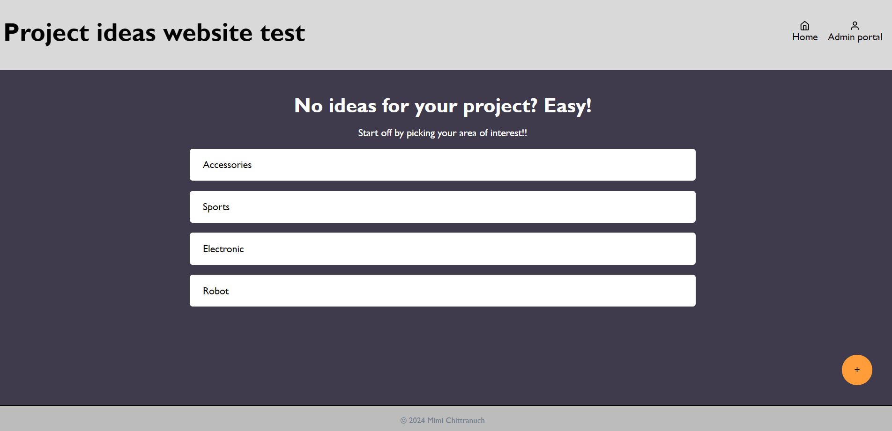

# The Design of a Database-Linked Website for NCEA Level 2

Project Name: **Technology's project ideas**

Project Author: **Chittranuch Tangitcharoen**

Assessment Standards: **91892** and **91893**

-------------------------------------------------

## System Requirements

### Identified Need or Problem

The client whom I am currently working with is a technology teacher at Waimea college. He says that sometimes students, especially girls, walk into the class without any ideas for what to do for their technology's project. Same as Dtd, problems or ideas play a big role in the subject because we are trying to find ways to make our lives better. Therefore, I would like to create a storage system where students can browse through to get inspirational ideas. 

### End-User Requirements
There are 2 types of main users that this system  is targeting:
- **Admin/My technology teacher**- He wants a place where he can store and put some ideas for a technology project for girls. Eventhough his IT skill is probably quite high level, the system should still be simple to use, easy and quick to add things on. He is likely to want the system's theme to be technology related as well.
- **Students**- Female students will be expecting to see a list of possible ideas for their technology projects that are not too difficult for them. Moreover, as they are girls, the ideas that are put in should be more related to girls. The system should be simple and easy to use because the students IT level will mostly vary from low to medium.

### Proposed Solution

The system that I intend to create will store a list of inspirational ideas for projects. Both types of end-user can view the list and click on links that are attached to the list to see the website or pictures related to the ideas. The teacher can also add ideas to the system through the add button.

Admin/My technology teacher should be able to:
- View the list of ideas
- Add ideas to the list
- Delete ideas from the list
- Click on links that are attached to the list

Students should be able to: 
- View the list of ideas 
- Click on links that are attached to the list

-------------------------------------------------

## Relevant Implications

### Functionality

The functionality of a system relates to how well the system functions or works for the end user we are aiming for. This can be linked to some of the 10 Nielson’s heuristics: Visibility of system status (This should always inform users of what is going on.), Error prevention (The system should prevent admin from committing an error.)

The functionality of a system is the most important implication in my opinion because if the system does not function, then it does not solve any problem at all, and the user cannot make use of it. Therefore, I will have to be very careful, check and save everything when creating the system to ensure that the system works properly.

2 Nielson’s heuristic that will have impact on my design are the visibility of system status and error prevention, but the one that I consider that I should be aiming for is the visibility of system status. The user should see a different color when they hover over a button to inform them that the system is working. To check this, I will let my end-user test the system which will then allow me to get some feeadback as well.

### Usability

The usability of system status relates to how easy it is to use for the user the system is aiming for.  

I will have to design a system that is easy and simple to use because my end user IT skills, more specifically, student’s IT skill is unlikely to be high level, or some are not skilled at all. So, I should aim for them to be able to use my system without any problem. 

As I design my system, I should be aiming for these Nielson’s heuristics that are related to the usability of a system: Consistency and standards (Keeping the layout and style the same all throughout the system to avoid confusion and to make the system look simple.) and  recognition rather than recall (My system should give my technology teacher a list of areas of interests for him to choose from rather than making him type it down when adding new ideas to the list.) 

### Aesthetics

The aesthetic implications of a system relate to how the system is in terms of its design. 

My target end users are students and teachers so the design should be simple and clean to use without making the user feel disturb while using the system. The design should also be technology-related to represents the subject.

Nielson’s heuristic that I should be considered as it is obviously related to the implications is the aesthetic and minimalist design. My system should be as simple and clean as possible. The theme of the system should be something related to technology too. Another heuristic that I can consider when creating my system is the match between the system and real world. I can put icons on as some decorations for my design as well as allowing the user to understand the system quickly. 

### End-users
The end-users implications are related to the need of the users. 

I have already asked my technology teacher, who will be one of the main end-users, what he needs and came up with a system that will show ideas for girl's technology projects. 

I must always think about talking and showing my progress to my end-user to get some feedback which I can fix or develop my system so that it will best meet the needs of my end-user. I should also show it to my friends to test if my system works and ask for some feedback from the students’ side of the end-users as well. 

### Intellectual property
Intellectual property (IP)  implications of a system relate to not infringing (violate, breaking the rules or law) the IP of the others in terms of copyright, trademarks, patents, etc.

I will have to use links and photos for my system relating to the ideas so I must make sure and check if things I am using are copyright and give credits if I need to, so I am not infringing the IP of the others.

I should also consider the appropriateness and safety of links and photos I am using as well. They should be related to technology and

## Final System Design

### Database Structure

### User Interface Design

-------------------------------------------------

## Completed System

### Database Structure

### User Interface Design

There are some changes in icons. They became more simple.

-------------------------------------------------

## Review and Evaluation

### Meeting the Needs of the Users
The need of my client is a website where students can browse through to get some ideas for their technology project. Using mys sytem, students can see ideas that are grouped in areas and details of each ideas (with external link to the actual website as well). They can also add ideas and areas to the system for other students to see. Admin can edit, delete ideas and view added-ideas table. So it met the client's main need and solve the problem.

<!-- Replace this text with a brief evaluation of how well you met the needs of your users. Look at what you initially wrote about who they are, what specific needs they have, etc. and discuss how well the system meets those needs. -->

### Meeting the System Requirements
My end user's requirement is for the system to be able to store ideas for students. So i created 2 tables in the database to store those ideas: areas table and ideas table. This also applies in terms of the simplicity of the website because ideas are grouped in area for the user, so it is easier and more conviient to browse through. My UI has got a lot of grey and orange colors on it as he specifically required, to give technology's room vibe. The components on the interface are quite big, haven't got many words on it and a variety of icons are used which are straight forward for the user to interpret. Therefore, the system is simple and suitable for any users in any levels of IT skills to use.

Both admin and students can also easily add areas/ideas to the website because an add button's position is fixed at the bottom of hompage and idea list page, so even if the user scrolls down, the button is fixed on the screen and can be clicked anytime.

<!-- Replace this text with a brief evaluation of how well you met the requirements that you defined at the start of the project, etc. Look back at the list of features / functionality you initially set and discuss how well your system has implemented each one. -->

### Review of Functionaliity

Replace this text with brief notes showing how the implication was addressed in the final outcome. Accompany the notes with screenshots / other media to illustrate specific features.

### Review of Usability

Replace this text with brief notes showing how the implication was addressed in the final outcome. Accompany the notes with screenshots / other media to illustrate specific features.

### Review of Aesthetics

Replace this text with brief notes showing how the implication was addressed in the final outcome. Accompany the notes with screenshots / other media to illustrate specific features.

### Review of End-users

### Review of Intellectual property

