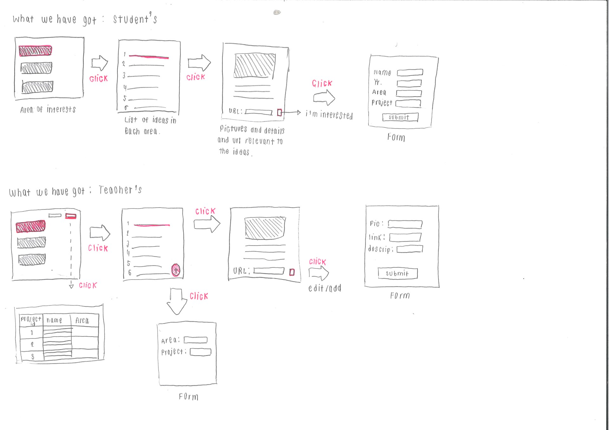
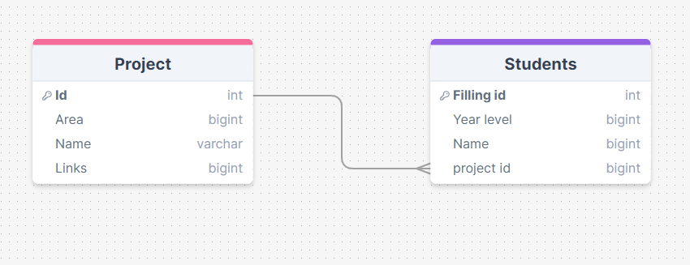
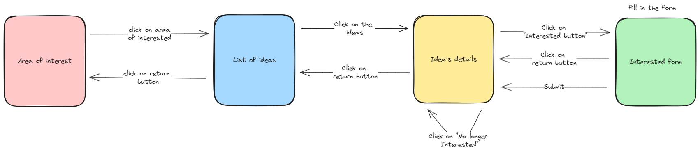
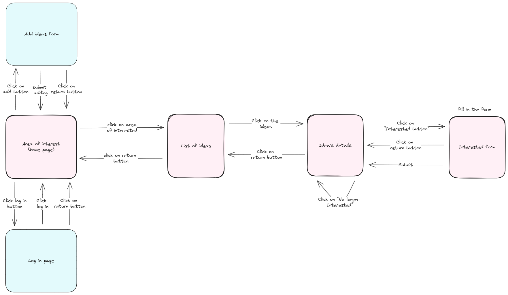
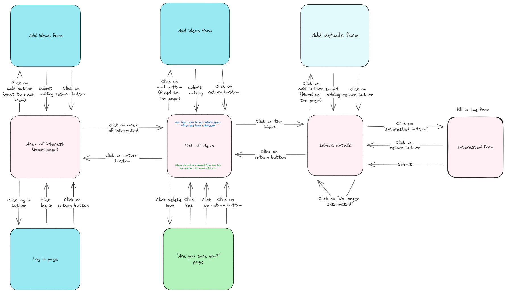
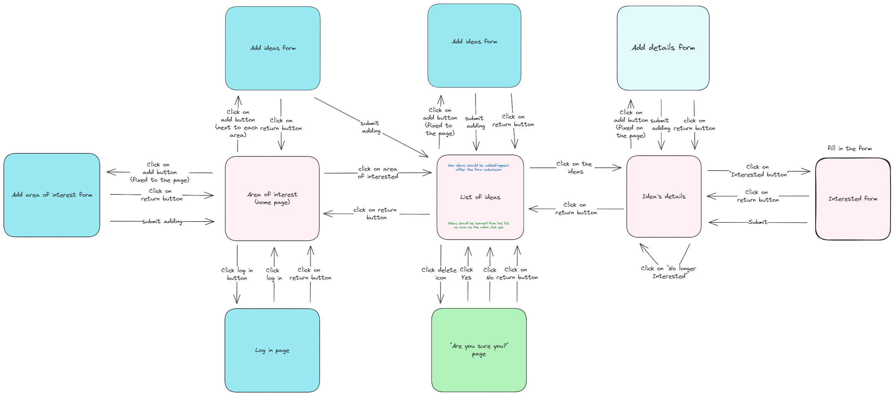
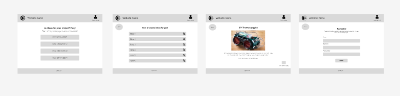
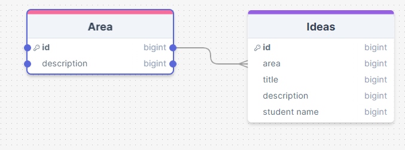

# Development of a Database-Linked Website for NCEA Level 2

Project Name: **PROJECT NAME HERE**

Project Author: **YOUR NAME HERE**

Assessment Standards: **91892** and **91893**

-------------------------------------------------

## Design, Development and Testing Log

### 16/05/2024

Brief UI design and how the system might work.

This is a sample design of my system as well as showing how it could work roughlt. I used this to talk to Mr. Copley if it is going to work and if the system meets all of the requirements. He said yes and noted that I should leave the last bit on the teacher's interface where he can edit the details until the very last and focus on making the other things perfect first. He also mentioned the portal log-in for the admin because he will be the only person who can add and make changes to the system. 

### 20/05/2024

Making and linking 2 tables for the database.

There are 2 tables for my database which are the project table and the student's table with the project id as a foreign key. This is just the first version of it. I will need to talk to my client to see if it needs to be alter or change.

### 21/05/2024

First version of student's interface view flow design. 

### 23/05/2024

flow design for both admin and students. Some color changes to avoid confusion

### 25/05/2024

Working on admin's inteface view flow design. I will make sure to talk to my client on Tuesday to see of any changes should be made. Especially the part where he deletes and submits the form.

### 27/05/2024

This is the finishing look for the first version of admin's interface view flow. I got a feed back from Jess, my classmate, suggesting that I should add the "add area of interest" form and after submitting the "add ideas form" from the home page, it should go to the "add ideas" page instead of the homepage. I will talk to my client tomorrow and see if any changes are to be made.

Pink = everyone, 
Blue = admin only, 
Light blue = the least priority, 
Green = unsure/need feedback/optional

### 30/05/2024

Working on student's UI

Got a feedback from my client on Friday on the system flow.
> I am not a girl myself, so I want them to be able to add stuff to the system as well.But I still have to be able to choose and check like which one can be added to the system.

So, my client wants students to be able to add ideas to the system. He wants to be able to see those added items and choose which one to add to or delete from the system. I have changed my mine on the database table, system flow and student's UI.
 