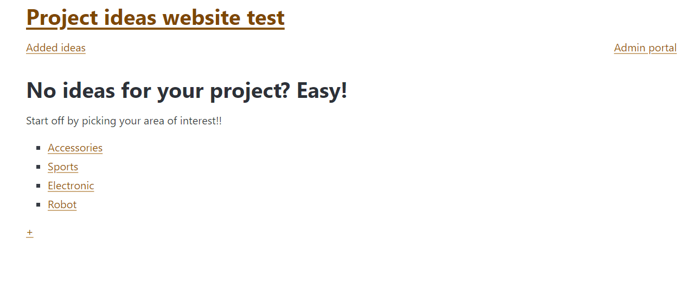

# Development of a Database-Linked Website for NCEA Level 2

Project Name: **PROJECT NAME HERE**

Project Author: **YOUR NAME HERE**

Assessment Standards: **91892** and **91893**

-------------------------------------------------

## Design, Development and Testing Log

### 16/05/2024

Brief UI design and how the system might work.

This is a sample design of my system as well as showing how it could work roughlt. I used this to talk to Mr. Copley if it is going to work and if the system meets all of the requirements. He said yes and noted that I should leave the last bit on the teacher's interface where he can edit the details until the very last and focus on making the other things perfect first. He also mentioned the portal log-in for the admin because he will be the only person who can add and make changes to the system. 

### 20/05/2024

Making and linking 2 tables for the database.

There are 2 tables for my database which are the project table and the student's table with the project id as a foreign key. This is just the first version of it. I will need to talk to my client to see if it needs to be alter or change.

### 21/05/2024

First version of student's interface view flow design. 

### 23/05/2024

flow design for both admin and students. Some color changes to avoid confusion

### 25/05/2024

Working on admin's inteface view flow design. I will make sure to talk to my client on Tuesday to see of any changes should be made. Especially the part where he deletes and submits the form.

### 27/05/2024

This is the finishing look for the first version of admin's interface view flow. I got a feed back from Jess, my classmate, suggesting that I should add the "add area of interest" form and after submitting the "add ideas form" from the home page, it should go to the "add ideas" page instead of the homepage. I will talk to my client tomorrow and see if any changes are to be made.

Pink = everyone, 
Blue = admin only, 
Light blue = the least priority, 
Green = unsure/need feedback/optional

### 30/05/2024

Working on student's UI

Got a feedback from my client on Friday on the system flow.
> I am not a girl myself, so I want them to be able to add stuff to the system as well.But I still have to be able to choose and check like which one can be added to the system.

So, my client wants students to be able to add ideas to the system. He wants to be able to see those added items and choose which one to add to or delete from the system. I have changed my mine on the database table, system flow and student's UI.
 

### 31/05/2024

This is a new version of system flow. Boxes in blue color are only for teacher/admin and actions in blue arrows can only be done when teacher/admin has logged in. Students are now able to add ideas to the system.

Also, a new version of students UI.

### 14/06/2024

I put the color from real time color into my user's interface design. Then I showed my client the system flow and the UI design to get some feedback.
> The flow and the UI look pretty good, but I would prefer the colors to be something like orange, cahrcoal and white because they are the colors that I can find in this room. As for the font, I quite a fan of Gilsans.

So my client want the colors orange, white and charcoal on the website and use Gilsans as a font.
Here are some options I made for my client for the colors:

### 07/07/2024
I am currentky working on the website write now.

Homepage:

Add new area form:

Idea list page:

Idea details:

Add new idea form:

Admin login:

Added ideas:

There is no longer "pick area of interest page " as designed because the user can simply add new ideas to the area that they have clicked into.

### 30/07/2024
Working on css and functionality of the website. I will make sure to have a chat with my client to see if I am on the right track.

### 07/08/2024
I caught up with my client today and had a chat about the overall functionality of the website and the design. He said that it is looking really good but there are 2 main things that I need to change to match his need:
1. The "position-sticky" of the top
> I prefer it to be non-sticky.

He also gave reasons that "there's nothing really important up there" and "it's taking quite a bit of the space of the screen, especially when it is small"

Sticky

non-sticky

2. Edit button
I asked him if he would like to be the only one who can edit details of ideas or students should also be able to do so as well. He said it is a "great idea" for the students to be able to edit them as well,

Can only edit when logged-in

Anyone can edit without logging in

I asked about how he would like the navigation bars to change as the user hovers over and at the moment, I am using the underline. I gave him an option of using an orange color.
>It looks more professional when it's underlined and i don't think the orange color really contrast with the background

Here's how it looks like

Lastly, he mentioned that if I have time, he wants the website to somehow allows him to check/approve to the added ideas from students before they actually go into the system/website.

### 09/08/2024

My client wants to be able to click the link not just on the external link icon but at the "Find out more" as well.

So i fixed it. The arange color represents how the link is being hover over at the moment.

### 15/08/2024

I just found that the form for editing requires a change in image, which is not necessary. So I removed the "required" form my php to make sure that you can submit the edit form without having to choose a new image.

I suuggested my client that it would be a great idea if you hover on the action buttons on the idea list and the color changes. He replied to me:
>Correct, colour changes over each button would be great, though how would it work on mobile?

I finished my edit form today. The edited data is also link to the added idea table so the changes will appear there as well.
This was what everything looked like before I started editing it.

Details page

Edit form

Added-ideas table

I changed "BellaBella" to "Bell" and uploaded a new image. These are what the details page, added-ideas table and form-edit look like after I edited them.

Details page:

Edit form

Added-ideas table

### 16/08/2024
Mr. Copley mentioned to me yesterday that it was not a good idea to let everyone be able to edit idea details. I then go on and talk to my client again about it, so he though about it again and agreed that admin should be the only person to be able to edit details.

So he wants to say that he think the title of the website on the top should be slightly bigger than the main heading of the homapge because at the moment, they are pretty much the same size.

I made the website title slightly bigger than the heading as he wants.

### 17/08/2024
Doing the code validations for each file
Homepage/Index:

Admin portal:

Add new area form:

Idea list:

Add new idea form:

Idea details:

Fixed:

Added ideas table:

Fixed:

Edit idea form:

Fixed:

Incorrect password or username page:

Fixed:

Homepage/index after log-in:

Idea list after log-in:

Idea details after log-in:

### 21/08/2024

Video of me demostrating how to use my website:
- How to view details and ideas within areas
- How to add new area
- How to add new idea
- How to edit details
- How to delete areas/ideas
- How to log-in and log-out
- How to view added tables

[Video Link](https://mywaimeaschool-my.sharepoint.com/:v:/g/personal/mtangitcharoen_waimea_school_nz/EVBMevLHw-dPuNYbdkYqnVcBlDZgLtVu5ispEkwWzn_UPA?nav=eyJyZWZlcnJhbEluZm8iOnsicmVmZXJyYWxBcHAiOiJTdHJlYW1XZWJBcHAiLCJyZWZlcnJhbFZpZXciOiJTaGFyZURpYWxvZy1MaW5rIiwicmVmZXJyYWxBcHBQbGF0Zm9ybSI6IldlYiIsInJlZmVycmFsTW9kZSI6InZpZXcifX0%3D&e=VyGOGP)

### 23/08/2024
I need to add a warning messsage on an edit form when the user is trying to upload an image to cover the Intellectual property implication (Mr. Copley's suggestion).
